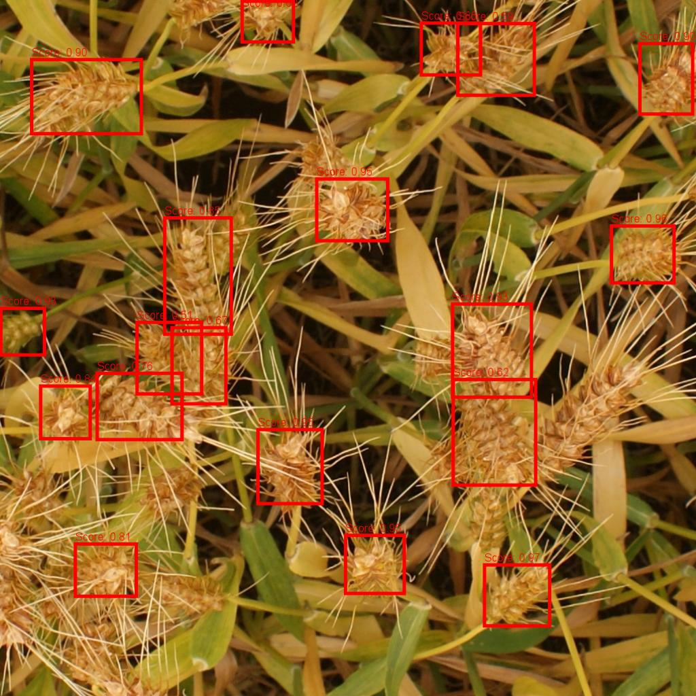

# Crop head counter (Node.JS)
 The Crop Head Counter is a machine learning model designed to accurately count and analyze the number of crop heads in agricultural fields. Utilizing advanced image processing and deep learning techniques, this model provides farmers and agronomists with precise data to optimize harvest planning, assess crop health, and improve yield predictions.

## Installation:
<ul>
<li>Download trained ONNX model for Crop head Detection and counting using <strong>JavaScript</strong>: <a href="https://drive.google.com/file/d/1P6QlU65kx289vxJdPEEekl4fqy9Tc5Zd/view?usp=sharing">Download</a></li>
<li>Download trained PyTorch model for Crop head Detection and counting using <strong>Python</strong>: <a href="https://drive.google.com/file/d/1xkWVMIwCrdDrotqRAdinXCKCdB9mYLaG/view?usp=sharing">Download</a></li>
<li>put trained model into: <strong>Crop-head-counter/trained-models/...</strong></li>
</ul>

## Input:

## Output:
"detectedCropHeads": 19,

"image":
